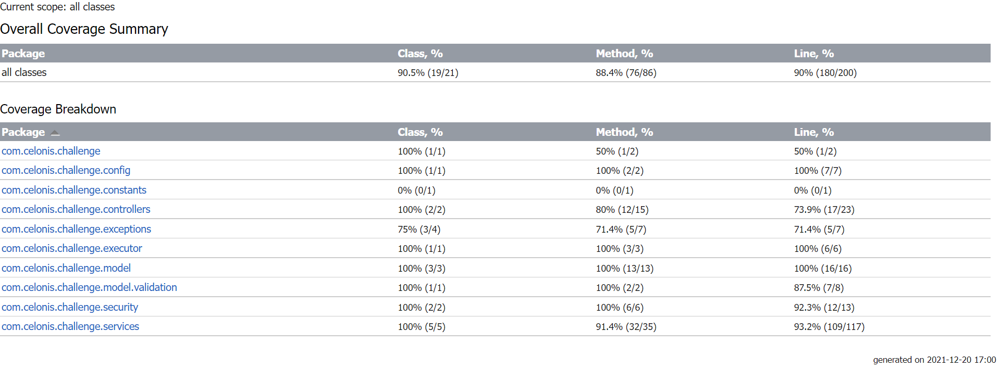

# Task Controller

	Run scheduled tasks using multithreading with Java and Completable Future, angular v11, and Integration test using Cypress.

# Swagger documentation

- Visit -> http://localhost:8080/swagger-ui/index.html

# Postman Collection

- Check File: TASK_CONTROLLER.postman_collection.json

# Test Converage Backend

You could check coverage folder to see in detail:



# Information

In application.properties file you can set different parameters:

```properties
# pool size
maximumThreads= 10
# every monday at 1 am
taskCleanUp.every= 0 0 1 * * MON
# seconds
taskCleanUp.ageMoreThan= 259200

```

# Start Application

- Start Backend project using your IDE.

- Start Frontend project:
  - Go to frontend folder
  - Run `bash npm i` to install dependencies
  - Run `bash npm run start`
- Visit http://localhost:4200

# Run e2e

- Start Application
- Go to e2e folder
- Run `bash npm i` to install dependencies
- Run `bash npm run test`
- Use Electron browser


# Frameworks

- Springboot
- Angular
- Cypress